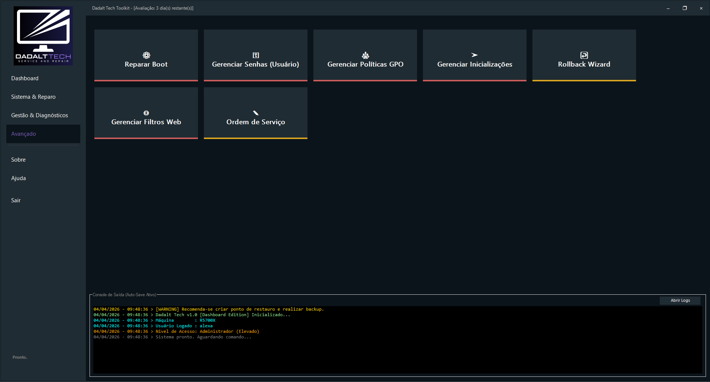

# Visão Geral do Sistema

O Dadalt Tech Toolkit é uma suíte de manutenção para Windows criada para dar ao técnico um ponto central de operação. O foco é reduzir o tempo gasto com tarefas repetitivas e deixar mais claro o caminho entre diagnóstico, correção e entrega.

## Para quem foi feito

- Técnicos de suporte e manutenção.
- Profissionais de assistência em bancada.
- Equipes de campo que precisam trabalhar com agilidade.
- Ambientes em que padronização e rastreabilidade importam.

## Como o sistema se organiza

O Toolkit foi pensado em blocos de trabalho. Cada área cobre um tipo de problema comum na rotina de TI:

- [Gestão e Diagnóstico](management.md): softwares, remoção, backup e triagem.
- [Segurança e Rede](security-network.md): defesa, políticas e correção de conectividade.
- [Sistema e Reparo](system-repair.md): manutenção do Windows, boot e otimização.

## Benefício prático

Em vez de alternar entre utilitários dispersos, o técnico encontra um fluxo mais direto para:

- localizar rapidamente a tarefa certa;
- executar correções com menos troca de contexto;
- documentar melhor o atendimento;
- entregar uma experiência mais profissional ao cliente.

## O que esta documentação cobre

- O uso público do produto.
- Requisitos e primeiros passos.
- Regras de licenciamento, Trial e ativação.
- Privacidade, suporte e dúvidas frequentes.

## O que esta documentação não faz

- Não expõe segredos internos de implementação.
- Não descreve componentes sensíveis além do necessário para uso público.
- Não inventa capacidades fora do que o produto realmente oferece.

## Ambiente de uso

O Toolkit foi desenhado para funcionar de forma portátil, com foco em atendimento técnico. Em cenários de validação online ou ativação, a conectividade pode ser necessária conforme a regra do plano ou do estado da licença.

A imagem mostra a área de comandos avançados, onde ficam tarefas como reparo de boot, políticas locais, filtros de rede, recuperação de acesso e geração de ordem de serviço.
