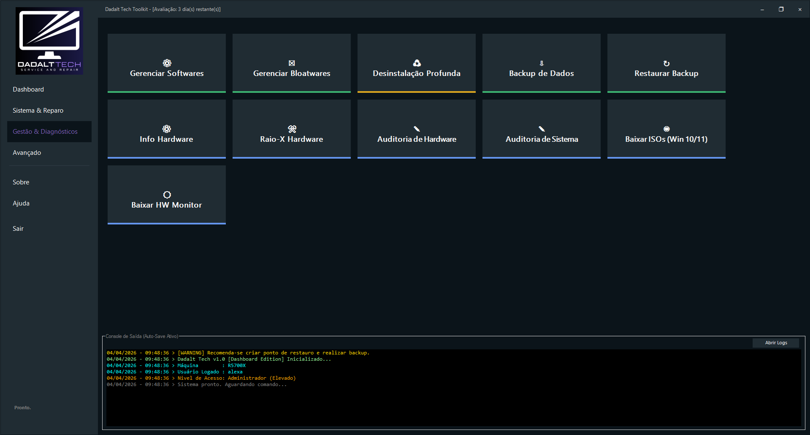
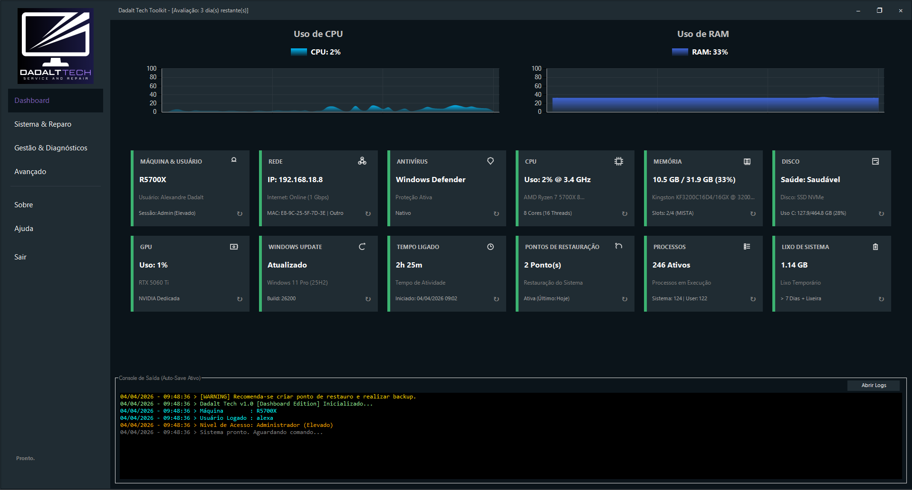

# Dadalt Tech Toolkit

O **Dadalt Tech Toolkit** é uma suíte portátil para manutenção, diagnóstico, reparo, otimização e produtividade pensada para técnicos de TI que atendem em bancada, em campo ou em laboratório.

Ele centraliza rotinas que normalmente exigem várias ferramentas separadas em uma interface única, mais rápida de operar e mais fácil de padronizar no dia a dia.

## Para que ele serve

- Acelerar atendimentos com tarefas comuns já organizadas por área.
- Reduzir troca de ferramentas durante diagnóstico, reparo e limpeza.
- Ajudar na remoção, reinstalação e validação de softwares com mais previsibilidade.
- Dar mais consistência ao fluxo de trabalho do técnico, sem perder clareza no processo.

## Baixe e teste

O Toolkit foi pensado para uso portátil e para avaliação antes da compra.

- [Baixar versão de avaliação](https://github.com/Aledd75/tools/releases/latest/download/DTToolkit.exe)
- [Entender licenciamento, Trial e ativação](licensing.md)
- [Ver a visão geral do sistema](about-toolkit.md)

> A avaliação, a ativação e a validação online são descritas publicamente nesta documentação. Detalhes internos de implementação não são expostos aqui.

## O que você encontra no pacote

### Gestão e Diagnóstico

Organiza instalação, remoção, backup e rotinas de triagem de software.

Na captura, você vê os atalhos principais para gerenciar softwares, remover bloatware, executar desinstalação profunda e apoiar tarefas de backup e diagnóstico.

### Segurança e Rede

Reúne ações de defesa, ajuste de políticas locais e correções de conectividade.

### Sistema e Reparo

Concentra manutenção do Windows, ajustes de performance e recuperação de inicialização.

Na captura, os blocos mostram a rotina de manutenção, reparo de boot, otimização e outras ações que normalmente fazem parte de um atendimento técnico completo.

### Dashboard principal

O painel inicial reúne os indicadores mais usados no atendimento, com foco em leitura rápida do estado da máquina e acesso direto aos módulos.

Na captura, aparecem os indicadores de CPU, RAM, disco, rede, antivírus, tempo ligado, atualizações e o console de logs da sessão.

## Por que isso é útil para técnicos

- Menos tempo alternando entre utilitários soltos.
- Mais padronização em atendimentos recorrentes.
- Mais clareza para o cliente quando a manutenção precisa ser explicada.
- Fluxo mais previsível para tarefas de suporte, limpeza e recuperação.

## Como a documentação está organizada

- [Visão Geral do Sistema](about-toolkit.md): panorama funcional do produto.
- [Primeiros Passos](getting-started.md): requisitos e início de uso.
- [Licenciamento, Trial e Ativação](licensing.md): regras públicas de uso e validação.
- [Perguntas Frequentes](faq.md): respostas rápidas para dúvidas comuns.
- [Solução de Problemas](troubleshooting.md): orientações práticas de suporte.
- [Como protegemos seus dados](privacy.md): aviso de privacidade v1.0.
