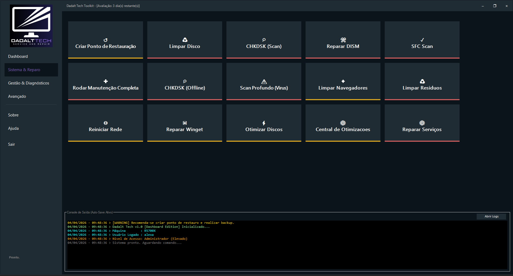

# Sistema e Reparo

Esta é a área dedicada à manutenção do Windows, à recuperação da inicialização e à aplicação de rotinas de correção que costumam consumir muito tempo quando feitas manualmente.

## Manutenção do sistema

O Toolkit organiza rotinas de reparo que ajudam a limpar e verificar o Windows com mais fluidez.

- Limpeza de arquivos temporários e caches comuns.
- Verificação e reparo de componentes do sistema.
- Execução de sequências de manutenção de forma guiada.

## Otimização

A área de otimização reúne ajustes que ajudam a manter a estação mais adequada ao uso técnico.

- Ajustes de desempenho e comportamento.
- Organização de rotinas para reduzir atrito no uso diário.
- Apoio a um ambiente mais estável para o atendimento.

## Reparo de inicialização

Quando o problema está no boot, esta área concentra o fluxo de recuperação.

- Ações de reconstrução e correção da inicialização.
- Apoio ao ambiente de recuperação do Windows.
- Fluxo mais simples para cenários de máquina que não sobe corretamente.

## Limpeza profunda

Se um software deixou rastros no sistema, a área de limpeza profunda ajuda a identificar e remover resíduos comuns após a desinstalação.

## Ferramentas essenciais

Quando há necessidade de recuperar componentes importantes do ecossistema Windows, esta área também concentra tarefas relacionadas a downloads e correção de dependências essenciais.

A imagem mostra os blocos de manutenção e recuperação organizados para execução rápida, incluindo limpeza, reparo, otimização e correção de inicialização.

## Resultado esperado

Uma bancada mais ágil, com menos tentativa e erro e mais clareza sobre qual etapa executar em seguida.
