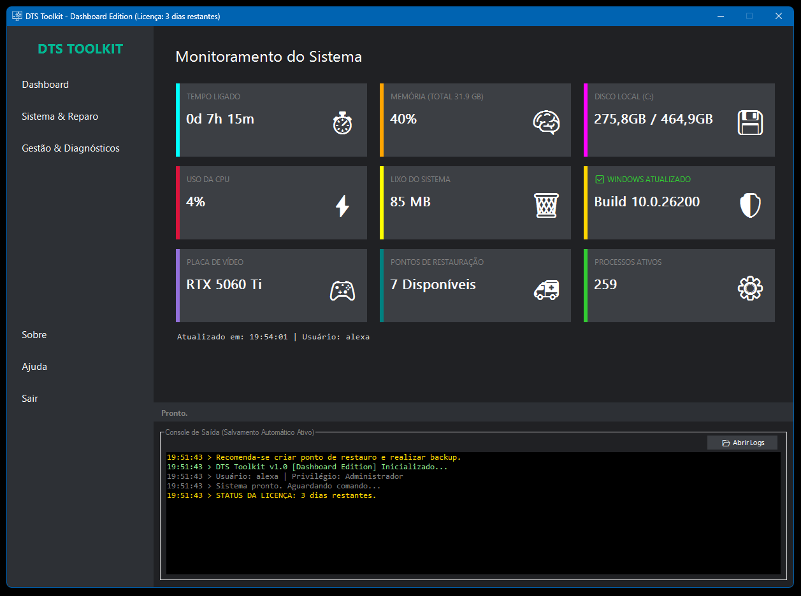

# Bem-vindo ao DTS Toolkit

O **DTS Toolkit (Dashboard Edition)** é uma solução "Tudo-em-Um" portátil desenvolvida pela **Dadalt Tech Solutions** para manutenção, otimização, segurança e diagnóstico avançado de computadores Windows.

{ width="100%" }

## Licenciamento e Acesso
O software opera com um sistema de proteção e licenciamento integrado:
* **Modo Trial:** Na primeira execução, uma licença de testes de **3 dias** é ativada automaticamente.
* **Modo Pro:** Requer chave de ativação anual (Ex: `DADALT-PRO-2026`).
* **Anti-Tamper:** O sistema possui proteção contra manipulação de data/hora (Erro de Relógio) para evitar burlar o período de testes.

## Principais Recursos

### 🚀 Manutenção & Reparo
* **Rotina Automática:** Executa limpeza, SFC, DISM e CHKDSK em sequência inteligente.
* **Reparo de Boot:** Reinstalação de BCD, MBR e ambiente WinRE.
* **Boost de Armazenamento:** TRIM para SSDs, Desfragmentação para HDDs e otimizações NVMe.

### 🛡️ Segurança & Políticas
* **Security Manager:** Varreduras rápidas de processos e memória.
* **Gestor de Políticas (GPO):** Bloqueio de USB, Painel de Controle, CMD e Executar (Kiosk Mode).
* **Browser Optimizer:** Auditória e remoção de extensões maliciosas em todos os navegadores (Chrome, Edge, Brave, etc).

### ⚡ Otimização de Sistema
* **Central de Otimização:** Ajustes granulares para Energia (Ultimate Performance), GPU (HAGS), Gaming (DVR Off) e Privacidade.
* **Debloat:** Remoção de Telemetria e Apps pré-instalados.

### 🔧 Gestão & Diagnóstico
* **Deep Uninstaller:** Remoção forense de softwares (arquivos e registros), com proteção para launchers de jogos (Steam, Epic, etc).
* **Relatório de Hardware:** Gera um dossiê HTML completo sobre o PC.
* **Backup & Restore:** Sistema inteligente que copia apenas arquivos novos ou alterados.

## Por que usar?
Projetado para técnicos de TI e usuários avançados. Não requer instalação, possui logs detalhados e mecanismos de segurança (como verificação de domínio antes de alterar DNS).